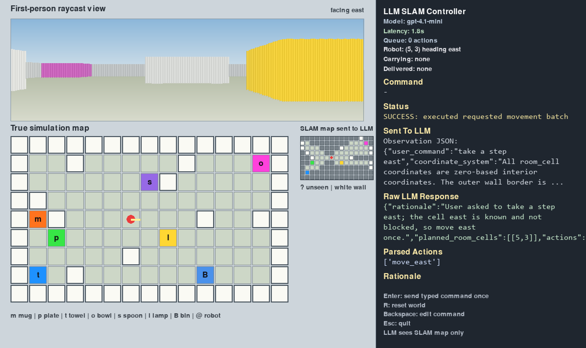

# LLM Agent in a Virtual World

A small grid world where an LLM-controlled agent can move, look around, build up
a partial map, find household objects, pick them up, and drop them in a bin.

This was built for the Humanoid intern challenge. The main point is the harness:
the LLM is placed inside an environment, receives a structured observation, picks
primitive actions, and the simulator executes those actions.

The final script is:

- mainSLAM.py

## Final UI

## Demo

## What It Shows

- A randomly generated grid world with walls, objects, a bin, and a robot.
- A first-person raycast view of what the robot can currently see.
- A full true map for debugging.
- A separate SLAM map that only fills in cells seen through the raycast field of view.
- The LLM only receives the SLAM map, not the full true map.
- Unknown SLAM cells are shown as ?.
- The LLM can explore unknown frontier cells until it finds the target.
- The side panel shows the prompt sent to the LLM, the raw response, parsed actions, rationale, latency, and simulator status.
- The full prompt/response/action trace is written to agent_run_log.jsonl.

## To Run

Install dependencies:

- pip install pygame openai

Set an API key.

Preferred direct OpenAI setup:

- $env:OPENAI_API_KEY="PASTE KEY"

OpenRouter also works:

- $env:OPENROUTER_API_KEY="PASTE KEY"

Run the final SLAM demo:

- python mainSLAM.py

Chat client can be tested separately with:

- python chat.py

## Controls

- Type a command and press Enter to send it to the LLM.
- R resets the world when the command box is empty.
- Backspace edits the command.
- Esc quits.

## Example Commands

- "find the mug"
- "go to the blue object"
- "pick up the towel"
- "bring the mug to the bin"
- "move east two cells"
- "turn right and move forward"

Color code for household objects:

- orange = mug
- green/lime = plate
- blue/cyan/azure = towel
- pink/magenta = bowl
- purple/violet = spoon
- yellow/gold = lamp

## How mainSLAM.py Works

mainSLAM.py keeps two maps:

- the real hidden map, used by the simulator
- the SLAM map, used by the LLM

The real map is still drawn on screen for debugging, but it is not sent to
the model. The LLM only sees cells that have been revealed by the robot's
raycast view.

The loop is:

1. Generate a random reachable room.
2. Cast rays from the robot's current position and heading.
3. Copy visible cells into the SLAM map.
4. Send the SLAM map and robot state to the LLM.
5. Parse the LLM's JSON response into primitive actions.
6. Run those actions in the simulator.
7. Update the raycast view and SLAM map again.
8. If the task is not done, ask the LLM for the next step.

For commands like "find the mug", the task does not stop after one move. The
agent keeps exploring unknown cells until the mug appears in the SLAM map, or
until the turn limit is reached.

The important point is that the LLM has to work from partial knowledge. It can
see the room size and its own position, but not the hidden object locations or
full wall layout.

## Observation Format

The model receives structured JSON text. It does not receive raw pixels.

The observation includes:

- user command
- room size and bounds
- spawn room cell
- robot room cell and heading
- inventory
- current cell information
- allowed actions
- SLAM room map
- discovered walls
- discovered traversable cells
- discovered objects
- unknown cells
- frontier cells next to known space
- SLAM coverage count
- move affordances for the next step
- directional clearance through known cells
- last simulator message

Map symbols:

- . known floor
- "#" known wall
- ? unknown/unseen cell
- @ robot
- B bin
- m mug
- p plate
- t towel
- o bowl
- s spoon
- l lamp

## Action Space

The agent can only use:

- move_north
- move_south
- move_east
- move_west
- move_forward
- move_back
- interact
- wait

Absolute moves also update the robot heading. For example, move_east makes the
robot face east.

interact picks up an object when standing on it. If the agent is carrying an
object and is standing at the bin, interact drops it in the bin.

## SLAM Behaviour

- The LLM does not know the full map at the start.
- It sees ? for unknown cells.
- It is told not to invent object coordinates it has not discovered.
- If the target is unknown, it should explore frontier cells.
- A frontier is an unknown cell next to known space.
- The model gets new SLAM data after every action.
- The task loop keeps asking for more actions until the goal is complete or the turn cap is reached.
- The current cap is 100 LLM turns per task.

This keeps the LLM in control while still making the environment honest: the
agent has to look around and build knowledge before it can solve the task.

## Logging

The app writes logs to:

agent_run_log.jsonl

Each run records:

- request prompt
- raw LLM response
- parsed actions
- preflight result
- simulator actions
- task completion status

This is useful for showing exactly what the model saw, what it decided, and how
that behaved in the world.

## Project Files

- mainSLAM.py - Final SLAM version. LLM sees only the discovered map and explores until goals are complete.
- LLM_integration.py - Simpler working baseline with full-map observation and raycast view.
- chat.py - OpenAI/OpenRouter client setup and simple chat test.
- agent_run_log.jsonl - Example trace log written by the app.
- raycast_test.py - Earlier raycast prototype if present in the repo.
- SLAM_test.py - Earlier SLAM prototype if present in the repo.
- media/ - Demo images/video thumbnails.
- README.md - Project documentation.

## Design Notes

- I used a grid world because the challenge is about the agent harness rather than graphics.
- The raycast view gives the agent a clear first-person world state as might be available on a real world humanoid robot.
- The SLAM map makes the observation partial, so the LLM has to explore, as a robot would in a real life scenario.
- The action space is deliberately small so the model output is easy to validate and transmit.
- The side panel and JSONL log are there to make the LLM loop inspectable for debugging.
- mainSLAM.py is the final version to run for the submission.

## Acknowledgements

Bhatti, S., Desmaison, A., Miksik, O., Nardelli, N., Siddharth, N. and Torr, P. (2016). Playing Doom with SLAM-Augmented Deep Reinforcement Learning. [online] arXiv.org. Available at: https://arxiv.org/abs/1612.00380 [Accessed 2 Jun. 2026].
