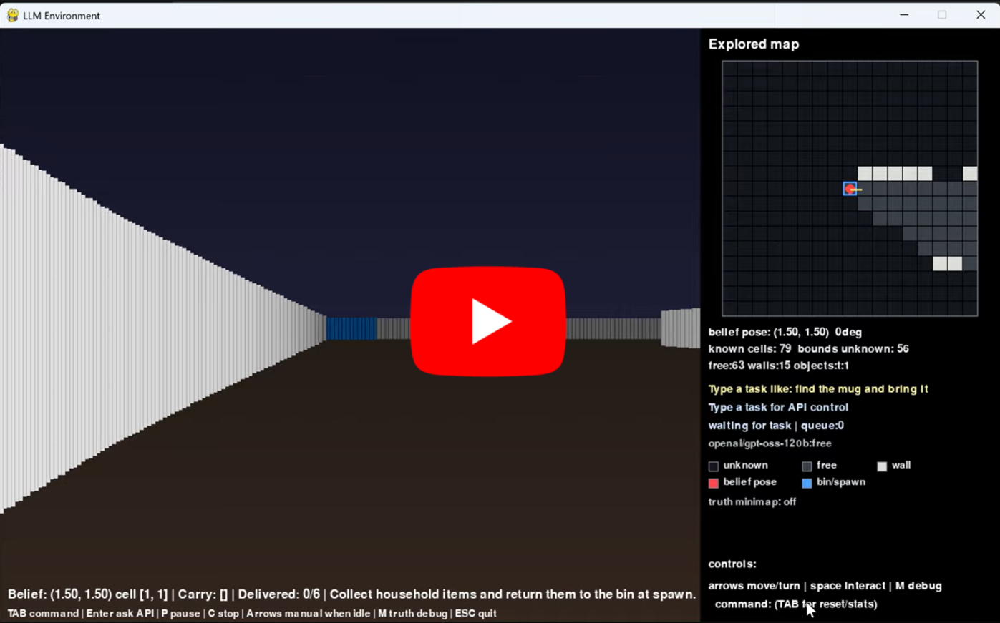

# LLM Agent in a Virtual World

A raycast world where an LLM-controlled agent can observe, plan, move, pick
up household objects, modelled as coloured tiles, and complete natural-language tasks.

This was built for the Humanoid intern challenge. The important part is the
harness: the model sees a structured observation, chooses from a small action
space, and the simulator verifies what actually happened.

## Demo

## What It Shows

- Random 2D grid world rendered as a first-person raycast view.
- SLAM-style explored map built from ray observations.
- Natural-language commands such as "put the towel in the bin".
- A constrained action space: move, turn, wait, and interact.
- Batched LLM action planning through an OpenRouter OpenAI-compatible API.
- Deterministic local planning for common tasks using BFS paths.
- State-based success checking so the agent cannot just claim it is finished.
- Frontier exploration when the target object has not been seen yet.

## To Run

### Install dependencies:

pip install pygame openai

### Get Free OpenRouter key by signing up with link:
https://openrouter.ai/openai/gpt-oss-120b:free

### set it as OPENROUTER_API_KEY in computer environment.

$env:OPENROUTER_API_KEY="PASTE KEY"

### Run main.py:

python main.py

## Example Commands

- "put the towel in the bin"
- "put all objects in the bin apart from the towel"
- "put pink and green in bin"
- "put lamp in bin first and then orange"
- "go to the green object and stop"
- "go to the top right corner"
- "spin in a circle once"
- "explore the map"

Color code for household objects:

- orange = mug
- green/lime = plate
- blue = towel
- pink/magenta = bowl
- purple = spoon
- yellow = lamp

## Controls

- Type a command and press Enter to start the agent.
- TAB toggles the command box.
- P pauses or resumes the current task.
- C cancels the current task.
- M toggles the true-map debug view.
- Arrow keys manually move when no task is active.
- SPACE manually interacts when no task is active.
- ESC quits.

## How main.py Works

1. It generates a random reachable grid map with walls, spawn ("bin"), and household
   objects.
2. It renders the world through raycasting inspired by the game DOOM, so the agent has 
   a limited first-person view rather than full map knowledge.
3. It updates a sparse explored map from the ray scan. Unknown cells stay
   unknown until seen.
4. It parses the user's command into useful intent: target objects, excluded
   objects, delivery tasks, navigation-only tasks, ordered tasks, exploration,
   and spin commands.
5. It first tries a local planner. This uses BFS over the explored map for
   reliable movement, pickup, drop-off, corner navigation, and frontier search.
6. If the local planner cannot solve the next step, it sends a compact JSON
   observation to the LLM.
7. The LLM must return only primitive actions such as move_forward,
   turn_left, or interact.
8. The simulator executes queued actions one at a time, applying collision
   checks and updating the belief map after each action.
9. After every primitive action, the verifier checks the real simulator state.
   If the task is complete, stale queued actions are cleared and the agent
   stops.

## Observation Format

The model receives structured text and a hidden prompt, not raw pixel data. The observation includes:

- belief position and heading
- current inventory
- task progress
- known object locations
- a local explored map around the robot
- a left-to-right ray scan
- parsed task intent

Map representation symbols:

- ? unknown
- . free space
- "#" wall
- @ agent
- B bin/spawn
- m, p, t, o, s, l objects

These give the system a clear map of surroundings whilst being easy to interpret for an LLM.

## Action Space

The agent can only use:

- "turn_left"
- "turn_right"
- "move_forward"
- "move_back"
- "interact"
- "wait"

interact picks up an object when standing on it. If the agent is carrying an
object and is back at spawn, interact drops it in the bin.

## Project Files

- main.py - Final demo, simulator, renderer, mapping, planning, API loop, and UI.
- SLAM_test.py - Manual SLAM and explored-map testing without the LLM loop.
- raycast_test.py - Earlier raycasting prototype.
- chat.py - OpenRouter/OpenAI-compatible client setup.
- README.md - Project documentation.
- Media/ - Folder containing videos and images.

## Acknowledgements

Bhatti, S., Desmaison, A., Miksik, O., Nardelli, N., Siddharth, N. and Torr, P. (2016). Playing Doom with SLAM-Augmented Deep Reinforcement Learning. [online] arXiv.org. Available at: https://arxiv.org/abs/1612.00380 [Accessed 2 Jun. 2026].